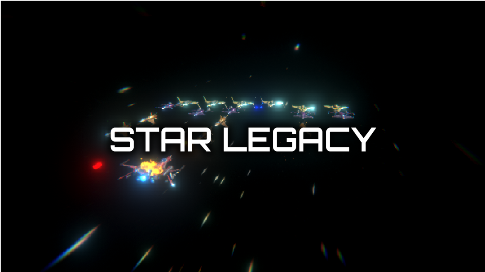
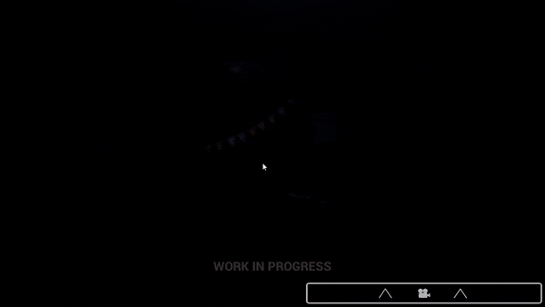
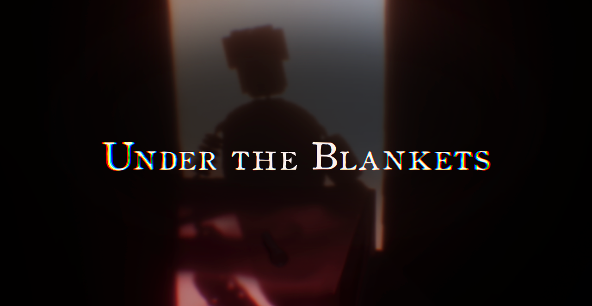

# About me!
I'm **Nicola Canzonieri**, a **computer science student** at the **University of Udine**. 

I'm passionate about **computer science**, **software programming**, and **videogames**. I also love **music** and **motorsport** in general.
In my free time, I like to work on projects, such as videogames or other software, or just listen to music. 

I love **challenges**, but if something doesn't make sense to me or I don't understand it, you can rest assured that sooner or later **I'll figure it out** the problem.

## My skills

### Most used

    
    
    
    
    

### Used in the past

    
    
    

## Socials

    
    
    
    
    
    

## My most used tools

    
    
    
    

## Progress

### Unity
<table>
    <tr>
        <td><b>Under The Blankets:</b></td>
        <td></td>
    </tr>
    <tr>
        <td><b>Under The Blankets Arcade:</b></td>
        <td></td>
    </tr>
    <tr>
        <td><b>Aura v2:</b></td>
        <td></td>
    </tr>
    <tr>
        <td><b>Lucid:</b></td>
        <td></td>
    </tr>
    <tr>
        <td><b>Retro GT:</b></td>
        <td></td>
    </tr>
</table>

### Python
<table>
    <tr>
        <td><b>access:</b></td>
        <td></td>
    </tr>
    <tr>
        <td><b>more incoming...</b></td>
        <td></td>
    </tr>
</table>

### Flutter + Dart
<table>
    <tr>
        <td><b>Aura v3: </b></td>
        <td></td>
    </tr>
    <tr>
        <td><b>more incoming...</b></td>
        <td></td>
    </tr>
</table>

### Java
<table>
    <tr>
        <td><b>ascii-snake:</b></td>
        <td></td>
    </tr>
    <tr>
        <td><b>more incoming...</b></td>
        <td></td>
    </tr>
</table>

### Rust + Slint
_No projects_

## A little bit of my story...

### The foundations

In 2020, I established **Sliced Games Studios**, a moniker under which I realized videogames using **Unity Engine**.

In 2021 I released my first ever game: [**Star Legacy**](https://sliced-games-studios.itch.io/star-legacy) for Android with the collaboration of an old friend [Broken Wings](https://www.youtube.com/@brokenwings2931).

    

In the same year I finished 7th in the **15th ScoreSpace Game Jam** with [**Star Rescue**](https://sliced-games-studios.itch.io/star-rescue).

In 2022 I announced the Five Nights at Freddy's Fan Game: [**Under The Blankets**](https://gamejolt.com/games/undertheblankets/838705). However the first gameplay has been shown on [**Game Jolt**](https://gamejolt.com/p/under-the-blankets-first-devlog-game-page-open-rshpkdnk) only in 2023. To date this game represents 4 years of game production experience in Unity.

    

Under the Blankets is also the combination of all my skills in: **game development**, **SFX and soundtrack**, **3D and 2D graphics**. As a matter of fact this game is entirely made by me, from top to bottom.

<!-- 

    

 -->

In 2023 I released Under The Blankets' prequel: [**Under The Blankets Arcade**](https://sliced-games-studios.itch.io/the-inventor) on [Itch.io](https://sliced-games-studios.itch.io/).

### Change of direction...

While my passion for game development remains, in 2024 I've discovered a new calling in **general-purpose software development**. In particular these new projects are focused on helping users achieve a **better lifestyle** and **mental health**. Parts of this transition are **Aura** for Android and **Lucid** for the web. Because of this change of direction I renamed Sliced Games Studios into **Halo Productions**.

### Other projects and opportunities

During my highschool period I worked on various **space and astronomy based simulations** with Unity.

In 2023 I joined the **UNIUD E-Racing Team**, the Formula SAE team of the **University of Udine**. During the first year I helped the team create an updated user interface for a telemetry software.

Joining the team is probably the greatest opportunity I have had in my career because I combined my passion for software development with the Motorsport culture, which is another great passion of mine.
